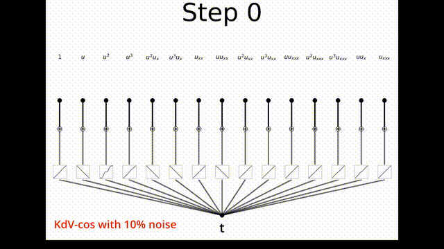
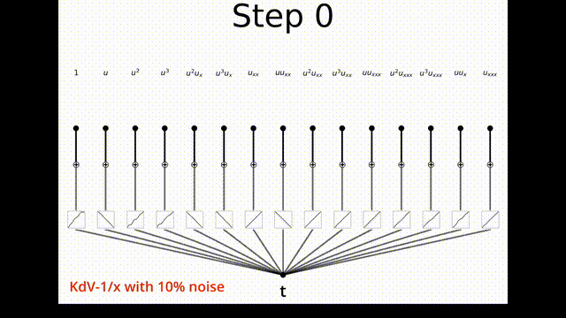
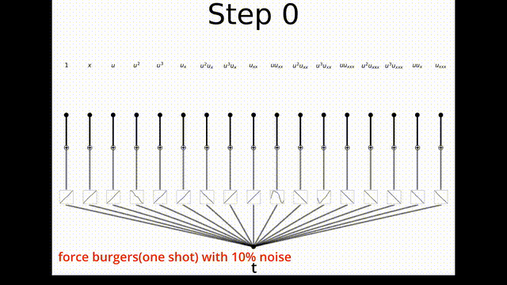
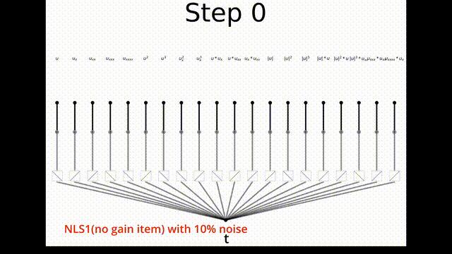
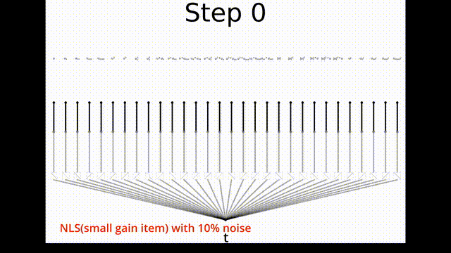

# Extracting Variable-coefficient Governing Equations with Kolmogorov-Arnold Networks and Sparse Regression from Limited Data

## Overview

Extracting governing equations for complex systems is a crucial task in scientific research. Traditional approaches often emphasize static properties of these equations, while real-world systems exhibit dynamic, evolving behavior influenced by a multitude of factors. In this work, we introduce a novel method that integrates single-layer Kolmogorov-Arnold networks (KANs) into the downstream operations of physics-informed neural networks (PINNs), paired with an alternating training strategy leveraging sparse regression algorithms.

Our approach stands apart by reconstructing the precise form of partial differential equations (PDEs) and identifying variable-coefficient functions using sparse data alone—without requiring prior knowledge. By symbolizing spline functions within the KAN layer, we derive expressions for these coefficient functions and uncover physically meaningful parameters. Through extensive numerical experiments, we demonstrate that our method is both robust and effective, handling complex systems with varying levels of data sparsity and noise. This work presents a powerful new solution for reconstructing and analyzing dynamic systems.

## Hardware Requirements

- **Processor**: AMD EPYC 7642 48-Core
- **GPU**: NVIDIA GeForce RTX 4090 (24GB)

## Installation

To set up the environment, ensure that Python 3.9.7 or higher is installed. Then, install the required libraries with the following command:

```bash
pip install -r requirements.txt
```

## Content

- **`reskan` folder**: Contains the core algorithm files. Notably:

  - `Model.py`: The main model implementation.
  - `Create_dataset.py`: Scripts for generating datasets based on the KdV and Burgers equations.
  - `Group_STR.py`: An improved group sparse regression algorithm and functions for interaction with the neural network model.
- **Equation-specific folders**:

  - **`vc_Burgers_equation`**,**`vc_KdV_equation`**,**`vc_NLS_equation`**: Each folder contains case studies for the respective equations, along with the training process and results. Sparse regression results for each stage are stored in the`vc_plot` subfolders.
- **`video` folder**: Contains visualizations of the training process for selected case studies of the three equations. These videos highlight the evolving state of the KAN layer at different training stages.

## Results of Numerical Experiments

Below are the results of five representative experiments, visualized as animations:

### KdV1 Experiment



### KdV2 Experiment



### Burgers Experiment



### NLS1 Experiment



### NLS2 Experiment




